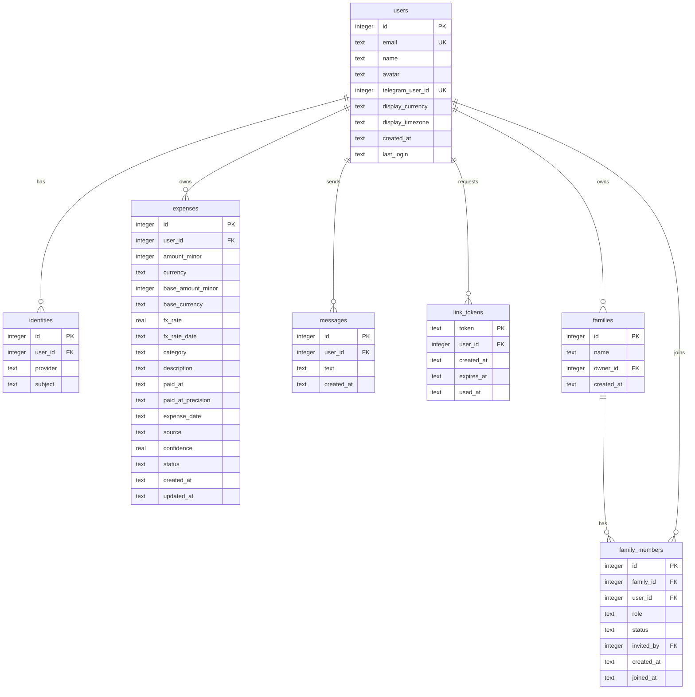

## Context

See `proposal.md` for motivation. The current storage spans two SQLite files with different schemas: `bot/src/db.ts` owns `messages` and `expenses`, `api/src/db.ts` owns `users` and `identities`. The bot writes expense rows with a `DD.MM.YYYY HH:MM:SS` `time` string, a nullable ISO `paid_at`, `REAL` amounts, a free-text `payer`, and a `status` of `pending | confirmed | rejected`. Nothing ties an expense to an account, and the API never reads expense data.

The bot is single-user in private chat today, with group support expected later. The web UI signs users in with Google behind an email allowlist. Both services run from Docker Compose with a shared `data/` volume.

The app is used by the author and their spouse today, but may open to outside users later. Expenses must be private by default, and sharing must be explicit through a family group rather than implicit through the shared database.

## Goals / Non-Goals

**Goals:**

- One database and one schema for both services.
- Every stored expense belongs to a registered, linked user.
- Dates, money and status have one unambiguous representation each.
- The bot stores nothing from senders who have not registered and linked.
- Expenses are private by default, and family membership is the only way to share them.
- The design stays small enough for a personal prototype.

**Non-Goals:**

- Preserving existing rows or the old schema.
- The dashboard read endpoints and the web UI work, which are separate changes.
- Multiple families per user, which the schema allows later by dropping one index.
- Automatic ownership transfer, which stays a manual step for now.
- Converting the display total with per-expense historical rates.
- User-defined categories, which stay a code-level enum.

## Decisions

### One shared database

Bot and API open the same SQLite file. Foreign keys and transactions work across all tables, and there is no cross-file coupling to reason about. The alternative, a bot database plus an API mirror, was rejected as more moving parts for no benefit at this scale.

### Single users table

There is one `users` table. A user is a person who registered through the allowlist, and the same row is the attribution target for expenses and messages. The alternative, separate `users` and `members` tables, exists only to hold people who never register. Since the registration gate means the bot accepts nothing from unregistered people, that class is empty, so the split adds a table and a resolution step for nothing.

### Registration and linking gate

The bot resolves the sender's Telegram id against `users.telegram_user_id` before doing any work. A miss produces one onboarding reply with the site link and nothing else. This closes the current hole where any member of a chat can write into the expense database. The rejected alternative, accept everyone and attribute later, keeps that hole and reintroduces shadow people.

### Telegram linking via one-time token

A signed-in user requests a link, the API writes a single-use token with a short lifetime, and the user presents it to the bot as a deep link in private chat or as a start command in a group. The bot learns the numeric Telegram id from the update, which is the only identifier a user cannot change or spoof. Alternatives: a Telegram username is mutable, optional and unverified; the Telegram Login Widget is authoritative but needs a second auth flow and BotFather domain setup, and can be added later if a login-time link is wanted.

### Private by default with family sharing

An expense is always owned by the user who logged it, and ownership never moves. Visibility is derived: a viewer sees their own expenses always, and another user's expenses only while both are active members of the same family. A family grants read access, it does not own data. The alternative, pairwise access grants from one user to another, was rejected because the product wants a group with a shared scope selector, and a group is the natural place to hang invitations and roles.

### One active family per user

A user has at most one active family at a time, enforced by a partial unique index on the membership table. The dashboard scope stays flat: me, my family, or one member. The alternative, many families per user, turns the scope selector into a tree and buys nothing for the current use. Dropping the index is the whole migration if that changes.

### Invitations require acceptance and owner-only issuing

The owner invites a registered user by email, which creates an invited membership that grants no access. The invitee accepts to become active, or declines to remove the row. Only the owner may invite, which is the least-privilege choice: a member who could invite would let a single participant widen who can read everyone's expenses. Inviting an email with no account is rejected, because the allowlist gates registration and there is nothing to attach the membership to yet.

### Visibility and scope resolved server-side

The API resolves a scope of me, family, or a member id into a set of user ids by querying active memberships, and every read intersects with that set. A requested member id outside the viewer's family is a 403, never a silent empty result. The alternative, trusting a user id from the query, is an authorization bypass and is rejected outright.

### Date model

Three distinct values, each with one job:

- `created_at`: when the row was written, ISO-8601 UTC with `Z`.
- `paid_at`: when the spend happened, local ISO-8601 with offset when the time is known, or a bare `YYYY-MM-DD` when only the date is known, paired with `paid_at_precision` of `date | minute`.
- `expense_date`: the local calendar day the expense is attributed to, materialized as `YYYY-MM-DD`.

`expense_date` exists because SQLite date functions convert offset timestamps to UTC before taking the date, so a local evening expense would land on the previous day. Grouping and filtering use `expense_date`; `paid_at` is kept for display and audit. The alternative, UTC only, loses the local day and the date-only case.

### Money and currency

Amounts are integer minor units with an ISO-4217 currency, never `REAL`, to avoid rounding drift in totals. Each row also stores a base-currency equivalent, the rate used and the rate date, all captured at write time so historical reports do not move when rates change. Base currency defaults to EUR. The display currency is a profile setting applied to the aggregate, so only one conversion runs per response. Alternatives: `REAL` amounts, rejected for rounding; read-time per-expense conversion, rejected as more queries and unstable history.

Rates come from Frankfurter, which serves ECB reference data without a key and exposes historical values by date. ECB does not publish on weekends or holidays, so the lookup takes the nearest rate on or before the spend date. An `exchange_rates` cache table stores fetched rates to avoid repeated calls. If no rate is available at write time, the base equivalent stays empty and a later backfill fills it.

### Expense status

`pending`, `confirmed` and `rejected` keep their current meaning. Only confirmed rows count as spend; pending amounts are reported separately so the dashboard can show spend plus an awaiting-confirmation figure; rejected rows are excluded everywhere and kept for history.

### Concurrency

The database runs in WAL mode with a busy timeout. The bot is the only writer of expenses and messages, the API is the only writer of users and tokens, and both are low frequency, so write contention is negligible. Prepared statements are used throughout.

## Schema



```sql
CREATE TABLE users (
  id                INTEGER PRIMARY KEY AUTOINCREMENT,
  email             TEXT NOT NULL UNIQUE,
  name              TEXT,
  avatar            TEXT,
  telegram_user_id  INTEGER UNIQUE,              -- NULL until linked
  display_currency  TEXT NOT NULL DEFAULT 'EUR',
  display_timezone  TEXT NOT NULL DEFAULT 'Europe/Madrid',
  created_at        TEXT NOT NULL,               -- ISO-8601 UTC
  last_login        TEXT NOT NULL
);

CREATE TABLE identities (
  id        INTEGER PRIMARY KEY AUTOINCREMENT,
  user_id   INTEGER NOT NULL REFERENCES users(id),
  provider  TEXT NOT NULL,
  subject   TEXT NOT NULL,
  UNIQUE (provider, subject)
);

CREATE TABLE expenses (
  id                INTEGER PRIMARY KEY AUTOINCREMENT,
  user_id           INTEGER NOT NULL REFERENCES users(id),
  amount_minor      INTEGER,                     -- original, minor units
  currency          TEXT,                        -- ISO 4217
  base_amount_minor INTEGER,                     -- base-currency equivalent
  base_currency     TEXT NOT NULL DEFAULT 'EUR',
  fx_rate           REAL,                        -- original -> base at write time
  fx_rate_date      TEXT,
  category          TEXT,                        -- key from the code enum
  description       TEXT NOT NULL,
  paid_at           TEXT,                        -- local ISO w/ offset, or YYYY-MM-DD
  paid_at_precision TEXT NOT NULL,               -- 'date' | 'minute'
  expense_date      TEXT NOT NULL,               -- local day, indexed for grouping
  source            TEXT NOT NULL,               -- 'text' | 'photo' | 'voice'
  confidence        REAL NOT NULL,
  status            TEXT NOT NULL DEFAULT 'pending',
  created_at        TEXT NOT NULL,
  updated_at        TEXT NOT NULL
);

CREATE INDEX idx_expenses_user_date ON expenses (user_id, expense_date);
CREATE INDEX idx_expenses_date      ON expenses (expense_date);

CREATE TABLE messages (
  id         INTEGER PRIMARY KEY AUTOINCREMENT,
  user_id    INTEGER NOT NULL REFERENCES users(id),
  text       TEXT NOT NULL,
  created_at TEXT NOT NULL
);

CREATE TABLE link_tokens (
  token      TEXT PRIMARY KEY,                   -- 128-bit, base64url
  user_id    INTEGER NOT NULL REFERENCES users(id),
  created_at TEXT NOT NULL,
  expires_at TEXT NOT NULL,
  used_at    TEXT
);

CREATE TABLE exchange_rates (
  id             INTEGER PRIMARY KEY AUTOINCREMENT,
  base_currency  TEXT NOT NULL,
  quote_currency TEXT NOT NULL,
  rate           REAL NOT NULL,
  rate_date      TEXT NOT NULL,
  source         TEXT NOT NULL,
  UNIQUE (base_currency, quote_currency, rate_date)
);

CREATE TABLE families (
  id         INTEGER PRIMARY KEY AUTOINCREMENT,
  name       TEXT,
  owner_id   INTEGER NOT NULL REFERENCES users(id),
  created_at TEXT NOT NULL
);

CREATE TABLE family_members (
  id         INTEGER PRIMARY KEY AUTOINCREMENT,
  family_id  INTEGER NOT NULL REFERENCES families(id),
  user_id    INTEGER NOT NULL REFERENCES users(id),
  role       TEXT NOT NULL,                      -- 'owner' | 'member'
  status     TEXT NOT NULL,                      -- 'invited' | 'active'
  invited_by INTEGER REFERENCES users(id),
  created_at TEXT NOT NULL,
  joined_at  TEXT,
  UNIQUE (family_id, user_id)
);

-- one active family per user
CREATE UNIQUE INDEX ux_family_members_active
  ON family_members (user_id) WHERE status = 'active';
```

## Risks / Trade-offs

- A single writer database with two services can still hit `SQLITE_BUSY` under a burst. Mitigated by WAL and a busy timeout, and by keeping writes short.
- Storing `expense_date` denormalizes a derived value that can drift from `paid_at` if a write path forgets to recompute it. Mitigated by computing both in one store function and never updating them independently.
- Capturing the FX rate at write time makes history stable but means a wrong rate is wrong forever. Mitigated by keeping the rate and its date on the row so it can be audited and corrected.
- Dropping all existing rows is irreversible. The old files stay on disk untouched until the new schema is verified, so a rollback is a revert of the code plus the old file.
- The bot token lives in the environment, so a leaked token lets someone talk to the bot, but the registration gate still blocks unlinked senders from writing.
- Linking tokens are a credential. Mitigated by 128-bit randomness, a short lifetime, single use, and binding to the creating user; unknown or reused tokens are ignored.
- The onboarding reply can be used to spam a group. Mitigated by replying once per unlinked sender and not on every message.
- The biggest new risk is an authorization bypass in the family scope: a viewer reading expenses outside their family. Mitigated by resolving scope server-side against active memberships and returning 403 for an out-of-family member, with a test per scope branch.
- An invitation alone must not leak data, and acceptance must be explicit. Mitigated by treating invited memberships as invisible until accepted.
- A member who could invite could widen the read set for everyone. Mitigated by restricting invitations to the owner.
- An owner leaving would strand the family. Mitigated by blocking owner exit while active members remain.

## Migration Plan

1. Add the schema creation and open the shared database path from configuration.
2. Rewrite `bot/src/db.ts` as the store for the new tables and update `bot/src/bot.ts` and `bot/src/confirm.ts` to resolve the sender to a linked user and compute `expense_date`, minor units and the base equivalent.
3. Rewrite `api/src/db.ts` to open the shared database and keep only user and identity concerns; add the link-token and family membership stores and the family routes.
4. Update `api/src/routes/auth.ts` and `api/src/config.ts`, plus `.env.example` and `docker-compose.yml`, to the single database path.
5. Delete the old local databases and re-collect from scratch. Keep the old files aside until the new flow is verified.

Rollback: revert the code and restore the previous database file. Since the change is greenfield, there is no forward data migration to reverse.

## Open Questions

- The exact token lifetime, proposed at 10 minutes, can be tuned without touching the schema.
- Whether the base-currency backfill runs as a bot-side job or lazily on read.
- Whether the onboarding reply should wait for a message that looks like an expense, or fire on the first message from an unlinked sender.
- Whether to hold an invitation for an unregistered email until that email registers, or keep rejecting it. Rejecting is simpler while registration stays allowlist-gated.
- How ownership transfers when the owner wants to leave, whether by promoting the earliest member or dissolving the family.
